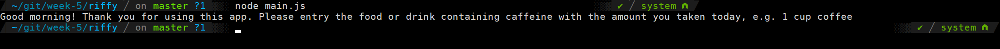
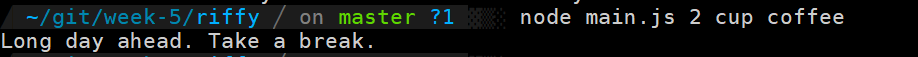

# How much caffeine

The how much caffein app will calculate the amount of caffein you already taken today, give you a piece of advice based on time and FDA recommended daily amount(400 mg).

## Example

- Without input (explain how to use.)

- With input

## What were used to built it

1. Javascript
2. Node
3. Date from Google

## Author

- How much caffeine app was made by Yiguo Qu.

## Future goal

- This app can only take one kind of food or drink and give advice right now. More update to have more user-terminal-interaction feather. 